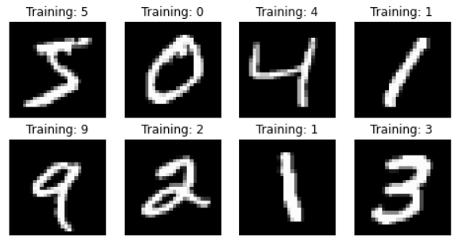
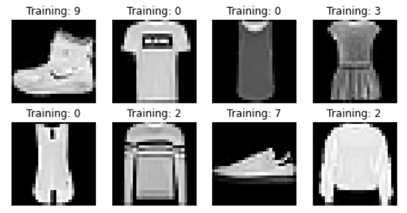

# mnist-with-error-analysis
## Purpose
Computer vision has become one of the most important area in computer science. During this project, we'll collected and pre-processed images from MNIST and fashion-MNIST images.You will see the performance of each model (Logistic Regression,svm, decision_tree, lightGBM) when they met hand-written/clothes images.In the end, this project will show how to do the error analysis over multi-labels. We will analyzed error on handwritten/clothes images and discovered several images are always easier to mis-classify than other numbers.

## Dependencies
- pandas
- numpy
- requests
- json
- sklearn
- matplotlib
- pytorch(MNIST and fashion-MNIST)
- pillow
- plotly
## Collect and Pre-Processed Images
The Mnist database is a large database which contained 70000 images of hand-written numbers(from 0 to 9).We can import the dataset from Pytorch directly. Mnist helped us split the train set and test set already(60000:10000). Here is the overview of the Mnist data set.

We could do some pre-processing and fit with the models that we choose.

## Model fitting
### Model choosing
As always, the module sklearn provided us various models to use directly. We will use Logistic Regression,svm, decision_tree, lightGBM at here to see their performance.

- Logistic Regression

- SVM

- Decision_Tree

- LightGBM

### Error analysis 

## Why not Mnist?
As you can see, Mnist is a well-established data set and has been overused in the data-science area. We can easily get 97% accuracy without fix too many issues.

## Results
