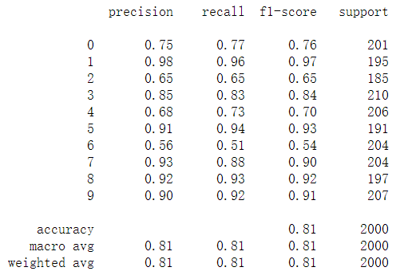

# mnist-with-error-analysis
## Purpose
Computer vision has become one of the most important area in computer science. During this project, we'll collected and pre-processed images from MNIST and fashion-MNIST images.You will see the performance of each model (Logistic Regression,svm, decision_tree, lightGBM) when they met hand-written/clothes images.In the end, this project will show how to do the error analysis over multi-labels. We will analyzed error on handwritten/clothes images and discovered several images are always easier to mis-classify than other numbers.

## Dependencies
- pandas
- numpy
- sklearn
- matplotlib
- pytorch(MNIST http://yann.lecun.com/exdb/mnist/ and fashion-MNIST https://github.com/zalandoresearch/fashion-mnist)
- pillow
- plotly
## Collect and Pre-Process Images
The Mnist database is a large database which contained 70000 images of hand-written numbers(from 0 to 9).We can import the dataset from Pytorch directly. Mnist helped us split the train set and test set already(60000:10000). Here is the overview of the Mnist data set.

Here is the distribution of handwritten digits in mnist dataset.

We could do some pre-processing and fit with the models that we choose.

## Model Challenging
### Model choosing
Sklearn provided us various models to use directly. We will use Logistic Regression,svm, decision_tree, lightGBM at here to see their performance.
- Logistic Regression

- SVM

- Decision_Tree

- LightGBM

Based on the report above, we can see that LightGBM and SVM performed pretty well on Mnist, which reached 96% and 94% accuracy respectively. 

### Error analysis 
However, the accuracy of Logistic regression and Decision tree do not meet our expectation. We can compare the predict value and the actual value in test set to see what could we do to improve the accuracy. Here is the plot for error anaylysis when using the Logistic Regression model.

The x-axis represent the error,the y-axis repensted the number of errors for each hand-written digit.For instance, we can find that when we predict number 0, number 8 is the most common error that the model would made. That is because people has different writing style. In some cases, the hand written digit 8 is similar to 0 which might lead some mikstakes for the model to predict the result.
After switching to decision_tree model, the plot for error analysis should be like:

In this spot, we can see decision tree performed badly on predicting digit 3. 
## Advanced to Fashion-Mnist
As you can see, Mnist is a well-established data set and has been overused in the data-science area. We can easily get 96% accuracy without fix any issues. Data scientists might need use other higher level datasets to test the accuracy of their model. Here I used the fashion-Mnist data set credit by Zalando Research on github (https://github.com/zalandoresearch). Different from the traditional mnist dataset, the fashion-Mnist consist of 10 classes cloth image. 
From 0 to 9, each number represents a class of cloth in fashion_mnist:

Below is the overview of Fashion-Mnist dataset.

### Performance

- Logistic Regression

- SVM

- Decision_Tree

- LightGBM

## Results
